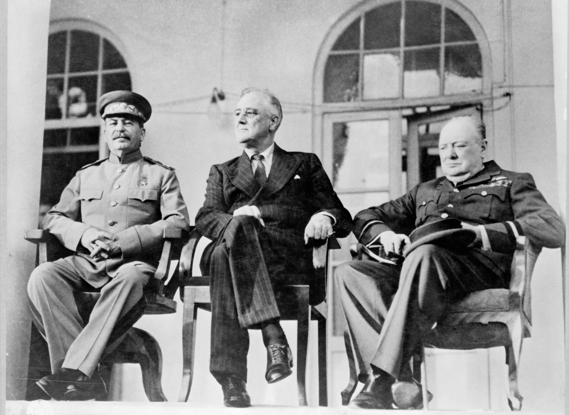

_Not pictured above: `map()`, `filter()`, or `reduce()`_

Previously, we saw how some programming languages allowed us to treat functions
exactly the same as objects. With this concept in mind, we implemented functions
that received one or more functions as input arguments and functions that
returned another function as an output. These can be categorized as
[higher order functions](https://en.wikipedia.org/wiki/Higher-order_function).

While higher order and first-class functions are related, the former is
characterizing some mathematical property of a function, while the latter is
describing an implementation detail for functions in a given programming
language. Although in the context of computer code, it would be hard to imagine
one without the other.

<!--more-->

Higher order functions are used all of the time if you look for them. Let's use
Javascript (ECMAScript 6) to explore the big three of functional programming:
map, filter, and reduce. Follow along using
[repl.it](https://repl.it/languages/javascript) or your web browser of
choice, but be vigiliant for any language incompatibilities.

### A primer on anonymous functions and lambdas

An [anonymous function](https://en.wikipedia.org/wiki/Anonymous_function),
commonly refered to as a lambda, is one that is not bound to an identifier. It
means that instead of defining a callable function like this:
```javascript
function add(a, b, c) {
  return a + b + c;
}
add(1, 2, 3);
```

We define a function without a name:
```javascript
// function (a, b, c) doesn't have an identifier. We were only able to capture
// it into a variable courtesy of first-class functions in Javascript.
let anonymousFunction = function (a, b, c) { return a + b + c };
anonymousFunction(1, 2, 3);
```

For conciseness and elegance, let's use ES6 arrow functions:
```javascript
// These are the same functions
let anonymousFunction = (a, b, c) => { return a + b + c };
let anonymousFunction = (a, b, c) => a + b + c;

// We can drop the parenthesis if we only have one input
let unaryFunction = a => a * 2;
unaryFunction(4);

// If we take in no input arguments at all
let nullaryFunction = () => console.log('I have no inputs!');
nullaryFunction();
```

In almost all cases, lambdas are short, nameless functions that are used only
once when passed into another function. Search the internet for Javascript arrow
functions if you need to familiarize yourself with the syntax.

## Map

The map function is seen in many programming languages and might be one of the
most prevalent higher order functions seen in the wild. For those unfamiliar
with map, it is a function that takes in a function and a list, and applies the
function to every element in that list.

If you wanted to apply the formula `3x + 7` to every element, you might do
something like the following using a traditional for loop:
```javascript
let list = [1, 2, 3, 4, 5, 6, 7, 8, 9];

// If you intend to change the original list
for (i = 0; i < list.length; i++) {
  list[i] = 3 * list[i] + 7;
}

// If you wanted to create a new list
let result = Array(list.length).fill(0);
for (i = 0; i < list.length; i++) {
  result[i] = 3 * list[i] + 7;
}

// Dynamically adding to a new list
let result = [];
for (i = 0; i < list.length; i++) {
  result.push(3 * list[i] + 7);
}
```

This is what it looks like using a map:
```javascript
let list = [1, 2, 3, 4, 5, 6, 7, 8, 9];
let result = list.map(x => 3 * x + 7);
```

The latter is more readable and maintainable because it captures the _essence_
of what the code is doing. It's more declarative than imperative since the code
doesn't concern itself with keeping track of the loop index, incrementing it,
terminating the iteration, or creating a new list or mutating the existing one.

Note: The map, filter, and reduce functions leave the original list unchanged.

## Filter

The filter function is also pretty common. It creates a list containing only the
elements that match a given condition.

Given a for loop with this logic:
```javascript
let list = ["apple", "banana", "orange", "date", "fig", "strawberry"];
let result = [];
for (i = 0; i < list.length; i++) {
  if (list[i].length > 5) {
    result.push(list[i]);
  }
}
```

Here is the equivalent using filter:
```javascript
let list = ["apple", "banana", "orange", "date", "fig", "strawberry"];
let result = list.filter(x => x.length > 5);
```

Like map, the filter function washes away all of the nitty gritty details about
the list iteration, and only leaves behind logic about _what_ the code is
actually doing.

## Reduce

Finally we have reduce, which iterates over a list and collects the terms into a
single value. This one is a bit of an oddball because it's not keeping the
list-to-list transformation.

If we have a for loop to get the product of all of the numbers in a list:
```javascript
let list = [1, 2, 3, 4, 5, 6, 7, 8, 9];
let result = 1;
for (i = 0; i < list.length; i++) {
  result *= list[i];
}
```

It might look like the following using reduce:
```javascript
let list = [1, 2, 3, 4, 5, 6, 7, 8, 9];
let result = list.reduce((x, y) => x * y);
```

I'm more inclined to agree that reduce can hamper code readability. Because you
can essentially transform a list of elements of a given type into _anything_
else, it should be used with care. It doesn't help that the function that is
passed into reduce takes in two parameters, which causes a bit more cognitive
overhead. In my opinion, using a for each loop with an accumulator variable is
just as effective and sufficient for most cases. Speaking of which..

## For each

`forEach` is another higher order function that appears in several programming
languages. It operates on every element of a list without returning anything:
```javascript
let names = ["John", "Jake", "Josh", "James", "Jerry"];
names.forEach(name => {
  console.log(`Nice to meet you, ${name}!`);
});
```

It's not as talked about in the functional programming world because it has no
return value, making it a _statement_ and not an _expression_. Think of it like
a void function, which violates the tenets of pure functional programming and is
thus absent from a language like Haskell. Still, it is a good tool to use in the
many imperative languages that support it, since it also abstracts away details
about list iteration and mutation like how map, filter, and reduce do.

## Map + filter + reduce

Surely no one is writing these single purpose for loops over and over again.
Most of the time, there is additional logic that you want to perform. Perhaps
you want check the list for certain items, then perform an operation on them.
Thankfully, that is when the composition of higher order functions comes in
handy.

Suppose you have a list marathon finishers and their average 1-mile pace in
minutes:
```javascript
let runners = [
  {name: 'John',  avgPace: 9.0, sex: 'M'},
  {name: 'Jane',  avgPace: 8.5, sex: 'F'},
  {name: 'Jake',  avgPace: 7.7, sex: 'M'},
  {name: 'Kate',  avgPace: 8.8, sex: 'F'},
  {name: 'Josh',  avgPace: 9.6, sex: 'M'},
  {name: 'Carly', avgPace: 7.1, sex: 'F'},
  {name: 'James', avgPace: 6.6, sex: 'M'},
  {name: 'Molly', avgPace: 6.5, sex: 'F'},
  {name: 'Jerry', avgPace: 6.0, sex: 'M'},
  {name: 'Sarah', avgPace: 7.5, sex: 'F'}
]
```

How many collectives minutes did the males run? If we wanted to figure this out
using a traditional for loop, we might do something like this:
```javascript
let totalMinutes = 0;
for (i = 0; i < runners.length; i++) {
  runner = runners[i];
  if (runner.sex === 'M') {
    let time = runner.avgPace * 26.2;
    totalMinutes += time;
  }
}
```

This is the equivalent if we chain map, filter, and reduce:
```javascript
let totalMinutes = runners.filter(
  runner => runner.sex === 'M'
).map(
  runner => runner.avgPace * 26.2
).reduce(
  (sum, time) => sum + time
)
```

Notice how these lambdas are small and modular. They compute a single isolated
piece of logic. They do one thing, and one thing only. We can clean this up
further if we define these helper functions separately:
```javascript
let isMale = runner => runner.sex === 'M';
let toMinutes = runner => runner.avgPace * 26.2;
let collectTimes = (sum, time) => sum + time;

let totalMinutes = runners.filter(isMale)
                          .map(toMinutes)
                          .reduce(collectTimes);
```

Hold on, aren't we iterating over our data multiple times? The for loop did all
of its computation in one pass. This is true - you probably don't want to use
these functions if you're chasing performance, but neither should you be using
Javascript if that's the case. Again the benefits of using map, filter, and
reduce is code maintainability. Not worrying about the details of list iteration
and focusing on the core logic itself can yield less bugs. While the big three
is not quite as powerful as raw for or while loops, they can get you pretty far
if you practice chaining them together.

## In closing

Higher order functions are just another tool in the toolkit. There are
definitely moments where one can go overboard with using these types of
functions. Code written with heavy abstractions can often be harder comprehend
than the equivalent version without them. Generally though, using higher order
functions along with map, filter, and reduce, can aid readability if the logic
is isolated and modular. As always, exercise good judgement, and use the right
tool for the job.
