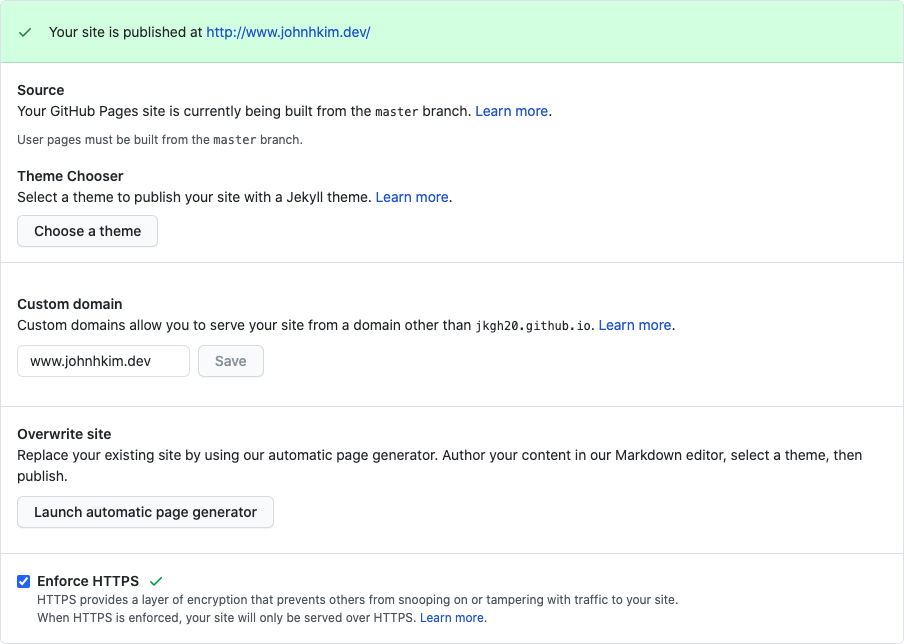
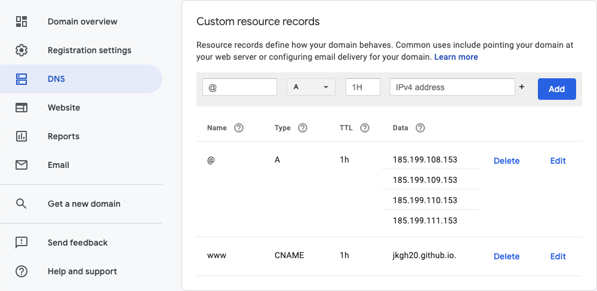

I've finally decided to come out of my shell and buy a proper domain to host my
static site on. I think it's also nifty how this website will be
self-documenting itself.

## Prerequisites

* A [GitHub Pages](https://docs.github.com/en/github/working-with-github-pages)
  repo (e.g. `<username>.github.io`)
* A custom domain from [Google](https://domains.google/).

<!--more-->

## Configuring GitHub Pages

[This is the official GitHub docs](https://docs.github.com/en/github/working-with-github-pages/managing-a-custom-domain-for-your-github-pages-site)
that I followed.

1. In your repo's settings, add a custom domain in the GitHub Pages section.
   Unlike the GitHub instructions, I added the `www` subdomain, since I was
   getting SSL certificate errors otherwise. Once you have saved this change,
   there should be a new commit that added a `CNAME` file with your domain.
1. Check the option to Enforce HTTPS. There's no reason not to as we are issued
   a certificate from Let's Encrypt for free.

This is what my GitHub repo settings look like at the end:

## Configuring Google Domains

1. Acquiring a domain from Google takes 5 minutes. First,
   [find your desired and unclaimed domain](https://domains.google.com/m/registrar/search?hl=en).
   Mine costs $12/year, which I think is quite reasonable.
1. In your domain's DNS settings, add the
   [IP addresses for GitHub pages](https://docs.github.com/en/github/working-with-github-pages/managing-a-custom-domain-for-your-github-pages-site#configuring-an-apex-domain)
   This is configuring the apex domain, e.g. `https://<your-domain>.com`.
1. Also in the DNS settings, add a CNAME record for the `www` subdomain to point
   to your GitHub Pages URL (e.g. `<username>.github.io`).

This is what my DNS settings look like at the end:

## Validating our changes

1. Navigating to `www.<your-domain>.com` in your web browser should take you to
   `https://www.<your-domain>.com`.
1. Navigating to `<your-domain>.com` should take you to
   `https://www.<your-domain>.com`. If you want to strip the `www` subdomain,
   change the custom domain field in your repo's settings, which will update the
   CNAME file. Again, I had SSL errors attempting to navigate to the `www`
   subdomain without it so I decided to keep it. Most browsers seem to hide it anyways.
1. Navigating to `<username>.github.io` should take you to
   `https://www.<your-domain>.com`.

See the
[GitHub guide](https://docs.github.com/en/github/working-with-github-pages/troubleshooting-custom-domains-and-github-pages)
on troubleshooting if you are having trouble with setting
up a custom domain.
