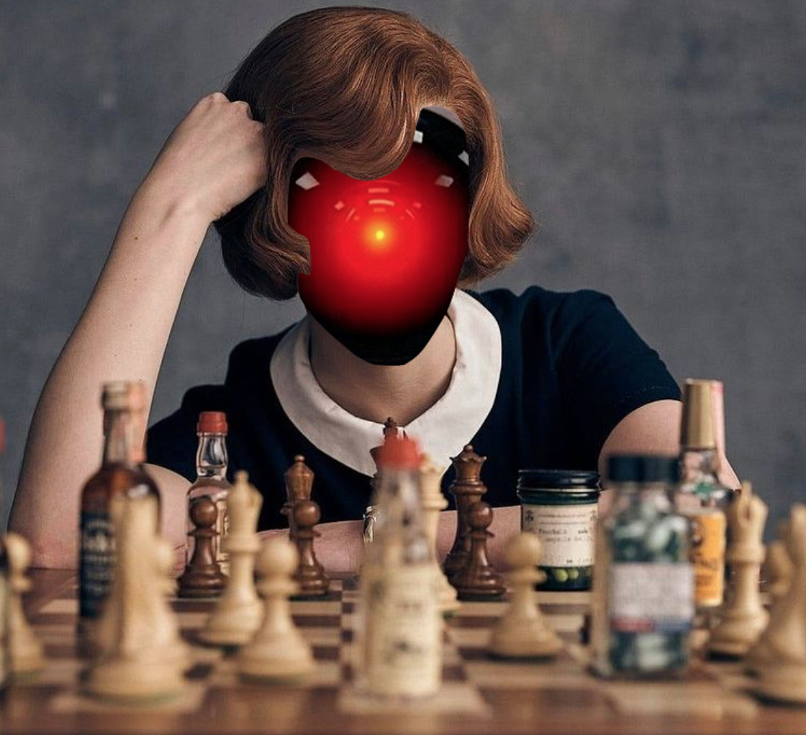
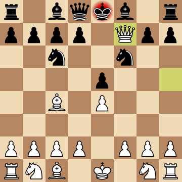

_I'm sorry Dave, I'm afraid I can't do that._ - HAL 9000, from 2001: A Space Odyssey

I have a big appreciation for all one-on-one, adversarial sports/activities
with a high skill ceiling, and chess is certainly no exception under that
criteria. I've been playing chess on and off since I learned the game in fifth
grade, hovering at a humble mid-thousand Elo rating. With such a low bar to
overcome, and with the series
[The Queen's Gambit](https://en.wikipedia.org/wiki/The_Queen%27s_Gambit_(miniseries))
airing recently, I thought: can I create a chess engine that beats even me?

I've done a similar task in college with the game
[Ticket to Ride](https://en.wikipedia.org/wiki/Ticket_to_Ride_(board_game)),
with the AI managing to beat me and other human players. But this is no Catan!
Or Stratego! We're talking about a game invented in the 6th century with deep
strategies and often complex positions. On the other hand, the task is not to
emulate Stockfish's performance; my AI won't be Deep Blue and I'm no Kasparov.
I can accept a small win if I can't pull off a cheeky checkmate on it, and
doubly so if it can last until the endgame.

<!--more-->

## Board representation and brute forcing

Jumping into this task, we're presented with a couple of problems before we
can even get to build AI:
* How can we represent the board?
* How can we make legal moves for each of the pieces?
* How can we detect board state? E.g. when a checkmate or a stalemate has occurred?

Luckily for us, the first Google search for a chess library yields
[python-chess](https://python-chess.readthedocs.io/), written in a language
we're all familiar with in this blog!
> python-chess is a pure Python chess library with move generation, move
validation and support for common formats.

This seems promising, with the ability show the board graphically, to do and
undo moves, detect attacks and threats, and detect checkmates/stalemates/draws.
Here are the simplest instructions to get it working, assuming you already have
`python3` and its corresponding `pip3` package installer:
```bash
$ pip3 install python-chess
$ echo "import chess

board = chess.Board()
print(board)
" > chess_ai.py
$ python3 chess_ai.py
r n b q k b n r
p p p p p p p p
. . . . . . . .
. . . . . . . .
. . . . . . . .
. . . . . . . .
P P P P P P P P
R N B Q K B N R
```

Hey! Not the prettiest thing, but you can make out the white and black pieces.
I haven't been able to get Jupyter Notebook running on my machine lately, but
there's a Jekyll plugin for it - a future enhancement perhaps. It looks just
like Lichess!


The ascii board will do for now. Let's continue in our actual python program now:
```python
print(board.legal_moves)
# <LegalMoveGenerator at 0x10f5a3820 (Nh3, Nf3, Nc3, Na3, h3, g3, f3, e3, d3, c3, b3, a3, h4, g4, f4, e4, d4, c4, b4, a4)>

board.push_san("e4")
print(board)
'''
r n b q k b n r
p p p p p p p p
. . . . . . . .
. . . . . . . .
. . . . P . . .
. . . . . . . .
P P P P . P P P
R N B Q K B N R
'''
```

So we have a way to get all of the legal moves within our board, and start
making moves - both of which will start helping us branch out towards new
board states. If you're unfamiliar with the combinatorics of chess, this means
we just can't start brute forcing our engine though it looks like we now have
the means to. After the first opening moves from black and white, there are 400
possible states. That number balloons up to 197281 after the second pair of moves.
There's actually a figure called the [Shannon number](https://en.wikipedia.org/wiki/Shannon_number):
> A conservative lower bound of the game-tree complexity of chess of 10^120,
based on an average of about 10^3 possibilities for a pair of moves consisting of
a move for White followed by a move for Black, and a typical game lasting about
40 such pairs of moves. I think we can be a little smarter about our engine, but
let's have a little fun first.

Let's cross the bridge for better decision making when we get there.

## Stupid AI

Steps:
1. Implement our program to commit a random legal move
1. We proceed to absolutely crush it in game

The following is a basic program to play against this AI, randomly choosing who
goes first. Digging around the library, I also found out python-chess supports
unicode characters! Player moves are made using
[algebraic notation](https://en.wikipedia.org/wiki/Algebraic_notation_(chess)) (e.g.
`Nf6` means move the knight to square f6). If you're also not familiar with this
notation or if there is an ambiguous move, type `help` when prompted.
```python
import sys

import chess
import random
import time

HUMAN = 'Dave'
AI = 'HAL'
INPUT_DELAY = 1.5


def start_game():
    print(f'Hello {HUMAN}, would you care for a game of chess?')
    board = chess.Board()
    print_board(board)

    play_chess = input('Yes/Y to continue, any other input to terminate: ')
    if not play_chess.lower() in ['yes', 'y']:
        sys.exit(0)

    # randint is inclusive on both ends
    current_player = HUMAN if random.randint(0, 1) % 2 == 0 else AI
    print('\n', f'A coin flip has determined that {current_player} will go first.', '\n')

    while not board.is_game_over():
        if current_player == AI:
            time.sleep(INPUT_DELAY)
            legal_moves = list(board.legal_moves)
            random_index = random.randint(0, len(legal_moves) - 1)
            move = str(legal_moves[random_index])
            board.push_uci(move)
            print(f'{AI} made a move:')
            print_board(board)
        else:
            while True:
                legal_moves = list(map(board.san, board.legal_moves))
                move = input('Your move (type help to get legal moves): ')
                if move.lower() == 'help':
                    print(legal_moves, '\n')
                    continue
                try:
                    board.push_san(move)
                except ValueError:
                    print('Please enter a valid move in algebraic notation (e.g. Nf3)')
                    continue
                print(f'You made a move:')
                print_board(board)
                break
        current_player = invert_player(current_player)
    if board.is_checkmate():
        print(f'{invert_player(current_player)} is victorious!', '\n')
    elif board.is_stalemate():
        print('A stalemate has occurred.', '\n')
    else:
        raise ValueError('Unknown board state: The game is over but there is no checkmate or stalemate.')

    input('Enter any input to terminate.')

def print_board(board):
    print(board.unicode(borders=True, empty_square=' '), '\n')

if __name__ == '__main__':
    start_game()
```

Here's what a game might look like:
```
$ python3 chess_ai.py
Hello Dave, would you care for a game of chess?
  -----------------
8 |♜|♞|♝|♛|♚|♝|♞|♜|
  -----------------
7 |♟|♟|♟|♟|♟|♟|♟|♟|
  -----------------
6 | | | | | | | | |
  -----------------
5 | | | | | | | | |
  -----------------
4 | | | | | | | | |
  -----------------
3 | | | | | | | | |
  -----------------
2 |♙|♙|♙|♙|♙|♙|♙|♙|
  -----------------
1 |♖|♘|♗|♕|♔|♗|♘|♖|
  -----------------
   a b c d e f g h

Yes/Y to continue, any other input to terminate: y

A coin flip has determined that HAL will go first.

HAL made a move:
  -----------------
8 |♜|♞|♝|♛|♚|♝|♞|♜|
  -----------------
7 |♟|♟|♟|♟|♟|♟|♟|♟|
  -----------------
6 | | | | | | | | |
  -----------------
5 | | | | | | | | |
  -----------------
4 | | | | | | | | |
  -----------------
3 | | | | | | |♙| |
  -----------------
2 |♙|♙|♙|♙|♙|♙| |♙|
  -----------------
1 |♖|♘|♗|♕|♔|♗|♘|♖|
  -----------------
   a b c d e f g h

Your move (type help to get legal moves): help
['Nh3', 'Nf3', 'Nc3', 'Na3', 'h3', 'g3', 'f3', 'e3', 'd3', 'c3', 'b3', 'a3', 'h4', 'g4', 'f4', 'e4', 'd4', 'c4', 'b4', 'a4']

Your move (type help to get legal moves): e6
You made a move:
  -----------------
8 |♜|♞|♝|♛|♚|♝|♞|♜|
  -----------------
7 |♟|♟|♟|♟| |♟|♟|♟|
  -----------------
6 | | | | |♟| | | |
  -----------------
5 | | | | | | | | |
  -----------------
4 | | | | | | | | |
  -----------------
3 | | | | | | |♙| |
  -----------------
2 |♙|♙|♙|♙|♙|♙| |♙|
  -----------------
1 |♖|♘|♗|♕|♔|♗|♘|♖|
  -----------------
   a b c d e f g h

HAL made a move:
  -----------------
8 |♜|♞|♝|♛|♚|♝|♞|♜|
  -----------------
7 |♟|♟|♟|♟| |♟|♟|♟|
  -----------------
6 | | | | |♟| | | |
  -----------------
5 | | | | | | | | |
  -----------------
4 | |♙| | | | | | |
  -----------------
3 | | | | | | |♙| |
  -----------------
2 |♙| |♙|♙|♙|♙| |♙|
  -----------------
1 |♖|♘|♗|♕|♔|♗|♘|♖|
  -----------------
   a b c d e f g h

Many moves later...

Your move (type help to get legal moves): Qf2
You made a move:
  -----------------
8 |♜|♞|♝| |♚|♝| |♜|
  -----------------
7 |♟|♟|♟|♟| |♟|♟|♟|
  -----------------
6 | | | | |♟| | | |
  -----------------
5 | |♘| | | | | | |
  -----------------
4 | |♙| | | | |♞| |
  -----------------
3 | | | | | | |♙| |
  -----------------
2 |♙| |♙|♙|♙|♛|♗|♙|
  -----------------
1 |♖| |♗|♕|♔| |♘|♖|
  -----------------
   a b c d e f g h

Dave is victorious!
```

Steps 1 and 2 accomplished, though it's hard to lose against this "AI" 😄


## Harder, Better, Faster, Stronger

We're now at the point where we can write the engine to start evaluating the
board. How can we determine if our position is good? What moves should we make?
When can we capture pieces? Can we move in such a way to shut down a threat
of checkmate?

When a human evaluates a board, they are often asking two questions:
* What pieces do you have and what intrisic values do they hold?
* Which pieces are valuable relative to their position on the board?

Let's start by considering just the former. You've probably encountered piece
values when playing chess online, seeing a `+5` on your screen when you've
captured a rook for example. Indeed, the most common point values used
in chess are:
* pawn: 1
* knight: 3
* bishop: 3
* rook: 5
* queen: 9

One oddity that we have to consider that traditional chess teachings ignore is
the value of the king. It turns out a lot of chess engines _do_ assign a value to
the king, from 3-4 (as an attacking piece) to infinity (game-ender if "captured"),
to other values like 200-600, relative to the weights above.

I'm finding out that Claude Shannon actually started looking into
[programming a computer to play chess as early as 1948](https://www.pi.infn.it/~carosi/chess/shannon.txt).
He actually uses the following weights with a crude evaluation function of the
board:
```
f(P)=200(K-K')+9(Q-Q')+5(R-R')+3(B-B'+N-N')+(P-P')-.5(D-D'+S-S'+I-I')
+.1(M-M')+...

in which:-
K,Q,R,B,B,P are the number of White kings, queens, rooks, bishops, knights
and pawns on the board.

D,S,I are doubled, backward and isolated White pawns.
M= White mobility (measured, say, as the number of legal moves available
to White).
```

So it looks like we have some weights and a simple evaluation function that our
AI can use. Notice that Shannon's function _does_ account for the location of
pieces. For now, let's ignore the positional strength of the pieces and code
up what we have, which might look something like the following:
```python
def evaluation_function(board, color):
    if board.is_checkmate():
        if color == board.turn:
            return float('inf')
        else:
            return float('-inf')

    num_white_pawns = get_num_pieces(board, chess.PAWN, chess.WHITE)
    num_white_knights = get_num_pieces(board, chess.KNIGHT, chess.WHITE)
    num_white_bishops = get_num_pieces(board, chess.BISHOP, chess.WHITE)
    num_white_rooks = get_num_pieces(board, chess.ROOK, chess.WHITE)
    num_white_queens = get_num_pieces(board, chess.QUEEN, chess.WHITE)
    num_white_king = 1

    num_black_pawns = get_num_pieces(board, chess.PAWN, chess.BLACK)
    num_black_knights = get_num_pieces(board, chess.KNIGHT, chess.BLACK)
    num_black_bishops = get_num_pieces(board, chess.BISHOP, chess.BLACK)
    num_black_rooks = get_num_pieces(board, chess.ROOK, chess.BLACK)
    num_black_queens = get_num_pieces(board, chess.QUEEN, chess.BLACK)
    num_black_king = 1

    # Using a modified Shannon's crude function:
    # f(P)=200(K-K')+9(Q-Q')+5(R-R')+3(B-B'+N-N')+(P-P')-.5(D-D'+S-S'+I-I')
    # +.1(M-M')+...
    white_material_value = KING_WEIGHT * (num_white_king - num_black_king) \
                           + QUEEN_WEIGHT * (num_white_queens - num_black_queens) \
                           + ROOK_WEIGHT * (num_white_rooks - num_black_rooks) \
                           + BISHOP_WEIGHT * (num_white_bishops - num_black_bishops) \
                           + KNIGHT_WEIGHT * (num_white_knights - num_black_knights) \
                           + PAWN_WEIGHT * (num_white_pawns - num_black_pawns)

    return white_material_value if color == chess.WHITE else -white_material_value
```

## Applying minimax on the game tree

> [Minimax](https://en.wikipedia.org/wiki/Minimax) is decision rule used in
artificial intelligence, decision theory, game theory, statistics, and
philosophy for minimizing the possible loss for a worst case (maximum loss)
scenario.

First let's start considering our chess board as a series of nodes in a tree, as
we've alluded to above when talking about search tree depth. The minimax
algorithm basically tries to minimize potential losses, usually in adversarial
zero-sum games with alternating sequences of events or moves. Each "layer" of
the tree will flip between maximizing the score for the current player, and
minimizing the score for the opposing player.

Here is how the minimax algorithm might be able to be represented in a game tree,
courtesy of Wikipedia:


What our AI must do is look-ahead down the tree to a certain depth to guarantee
its maximum potential value using the evaluation function on the current chess
board. Note that in the process, we are assuming that _both_ actors are making the
most rational/optimal decisions in trying to achieve the highest score.

So we need to recursively progress down the game tree and anticipate the
opponent's best moves. Because we're computationally bound by the expotentially
growing number of board states as we've seen previously, we'll only calculate
k-layers deep. We can always tweak k for the AI to be as strong/slow as we desire.

Given this info, the minimax algorithm roughly abides by the following steps:
1. In layer 0, consider all possible next moves (i.e. children in our tree)
1. In those next moves, consider the minimum score that our opponent can force us to receive.
    1. Pick the maximum node of these choices.
    1. However, in order to know the minimum score that our opponent can force us to receive, we must go to the next layer (layer 1).
        1. For each next move in layer 1, we consider their child nodes.
        1. For each child node (possible move by our opponent), we consider the maximum score that we can achieve.
        1. So the minimum score that our opponent can force us to receive is the minimum node.
        1. But to know the maximum score that we can achieve, we must go to the next layer (layer 2), and so on.

At the end of our predefined limit, i.e. layer k, the final board state is
evaluated and backtracked all the way down to layer 0. After we've finished
backtracking, we could finally choose the move with sufficiently optimal play
based on the information we gathered. Our minimax function might look like
the following:
```python
def minimax_function(board, k, value, is_maximizer, color):
    legal_moves = list(map(str, board.legal_moves))
    if not k or not legal_moves:
        return None, value

    min_value = 1000000
    max_value = -1000000
    random.shuffle(legal_moves)
    best_move = legal_moves[0]

    for child_move in legal_moves:
        board.push_uci(child_move)
        value = evaluate_board(board, color)
        child_best_move, child_value = minimax(board, k - 1, value, not is_maximizer, color)
        board.pop()

        if is_maximizer:
            if child_value > max_value:
                max_value = child_value
                best_move = child_move
        else:
            if child_value < min_value:
                min_value = child_value
                best_move = child_move

    return (best_move, max_value) if is_maximizer else (best_move, min_value)
```

And it lives! The AI seems to have some semblance of game knowledge when I play it.
I can only use `k=3`, with `k=4` moves taking on the order of minutes. One point
that bears repeating is that _it assumes that the opponent is playing optimally_.
I spent some time trying to bait the AI to Fool's Mate me on purpose before
realizing that the AI expects better from its opponent. Indeed, when I inspect
its brain in the debugger, I can actually see that it considers it as one of the
possible states in just the opening move:
```
Given a call like this in the stack: minimax_function(board, k=1, value, is_maximizer=True, color=chess.WHITE)

I can observe the following:
  -----------------
8 |♜|♞|♝| |♚|♝|♞|♜|
  -----------------
7 |♟|♟|♟|♟| |♟|♟|♟|
  -----------------
6 | | | | |♟| | | |
  -----------------
5 | | | | | | | | |
  -----------------
4 | | | | | | |♙|♛|
  -----------------
3 | | | | | |♙| | |
  -----------------
2 |♙|♙|♙|♙|♙| | |♙|
  -----------------
1 |♖|♘|♗|♕|♔|♗|♘|♖|
  -----------------
   a b c d e f g h
```

But it **does not** necessarily make black's king's pawn push, because the
algorithm very well knows I can thwart an attempt to mate me in the very next
move. So we usually expect to get a different random move from black. However,
the only time I've been able to Fool's Mate myself is when I push `e3`, black
_happens_ to push its king's pawn, _and then_ I push `g4`; then black's queen
will pounce on the opportunity. On the other hand, my attempts to Fool's Mate or
Scholar's Mate my engine have been thwarted so I consider this experiment a
small win for now.

## Next steps

### Weighing piece positions

One thing I have to note is that standard chess positions have been extremely
hard to replicate against this AI (e.g. pushing pawns to the center, not moving
knights to the edges, etc). This is because the computer plays completely random
moves when there are no material gains/losses within its k-horizon.

This is when we have to address positional advantages for each of the pieces.
You intuitively sense this, knowing that having knights outposted in the center
are extremely powerful, as with bishops controlling the longest diagonal of the
board. I found a
[chess programming resource](https://www.chessprogramming.org/Simplified_Evaluation_Function)
with a reasonable enough heatmap that would probably suffice, with some decent
justification of its values. The heatmaps might look something like the
following (note that these values are for white pieces, which will be flipped
the AI is playing black pieces):
```python
pawn_map = [
     0,  0,   0,   0,   0,   0,  0,  0,
    50, 50,  50,  50,  50,  50, 50, 50,
    10, 10,  20,  30,  30,  20, 10, 10,
     5,  5,  10,  25,  25,  10,  5,  5,
     0,  0,   0,  20,  20,   0,  0,  0,
     5, -5, -10,   0,   0, -10, -5,  5,
     5, 10,  10, -20, -20,  10, 10,  5,
     0,  0,   0,   0,   0,   0,  0,  0]

knight_map = [
    -50, -40, -30, -30, -30, -30, -40, -50,
    -40, -20,   0,   0,   0,   0, -20, -40,
    -30,   0,  10,  15,  15,  10,   0, -30,
    -30,   5,  15,  20,  20,  15,   5, -30,
    -30,   0,  15,  20,  20,  15,   0, -30,
    -30,   5,  10,  15,  15,  10,   5, -30,
    -40, -20,   0,   5,   5,   0, -20, -40,
    -50, -40, -30, -30, -30, -30, -40, -50]

bishop_map = [
    -20, -10, -10, -10, -10, -10, -10, -20,
    -10,   0,   0,   0,   0,   0,   0, -10,
    -10,   0,   5,  10,  10,   5,   0, -10,
    -10,   5,   5,  10,  10,   5,   5, -10,
    -10,   0,  10,  10,  10,  10,   0, -10,
    -10,  10,  10,  10,  10,  10,  10, -10,
    -10,   5,   0,   0,   0,   0,   5, -10,
    -20, -10, -10, -10, -10, -10, -10, -20]

rook_map = [
     0,  0,  0,  0,  0,  0,  0,  0,
     5, 10, 10, 10, 10, 10, 10,  5,
    -5,  0,  0,  0,  0,  0,  0, -5,
    -5,  0,  0,  0,  0,  0,  0, -5,
    -5,  0,  0,  0,  0,  0,  0, -5,
    -5,  0,  0,  0,  0,  0,  0, -5,
    -5,  0,  0,  0,  0,  0,  0, -5,
     0,  0,  0,  5,  5,  0,  0,  0]

queen_map = [
    -20, -10, -10, -5, -5, -10, -10, -20,
    -10,   0,   0,  0,  0,   0,   0, -10,
    -10,   0,   5,  5,  5,   5,   0, -10,
     -5,   0,   5,  5,  5,   5,   0,  -5,
      0,   0,   5,  5,  5,   5,   0,  -5,
    -10,   5,   5,  5,  5,   5,   0, -10,
    -10,   0,   5,  0,  0,   0,   0, -10,
    -20, -10, -10, -5, -5, -10, -10, -20]

king_map = [
    -30, -40, -40, -50, -50, -40, -40, -30,
    -30, -40, -40, -50, -50, -40, -40, -30,
    -30, -40, -40, -50, -50, -40, -40, -30,
    -30, -40, -40, -50, -50, -40, -40, -30,
    -20, -30, -30, -40, -40, -30, -30, -20,
    -10, -20, -20, -20, -20, -20, -20, -10,
     20,  20,   0,   0,   0,   0,  20,  20,
     20,  30,  10,   0,   0,  10,  30,  20]
```

Combining the material that the player has, in addition to their placement on
the board will yield a stronger evaluation function, and might start resembling
basic chess principles.

### Alpha-beta pruning

Like we discussed above, our search depth was bound by the huge number of
computations that need to occur when we explore just one more layer of our game
tree. As it turns out, we don't actually have to evaluate all of these branches
if we know that a given move is proven to lead to a worse state than a
previously examined one.

[Alpha-beta pruning](https://en.wikipedia.org/wiki/Alpha%E2%80%93beta_pruning)
is an optimization method that does exactly this, and it does not alter the
outcome of our minimax algorithm. It's a way to disregard branches in the
search tree, which ultimately helps us to evaluate the minimax search tree
deeper. We can enhance it if we can also somehow find ways to visit the
optimal paths first, which we can probably narrow down with additional
heuristics. We'll explore and implement this concept in the next part.

### Adding chess specific heuristics

Speaking of heuristics, there are concepts that we can apply specific to chess.
For example:
* in many engines, bishops an knights weighted differently. I've seen bishop
weights around 350-330 to a knight's 310-330. It's often mentioned in chess
instructionals that bishops are particularly more useful in endgames vs in the
middlegame.
* one more thing to do with weights as you've noticed above: a knight or bishop
should be considered better than 3 pawns, discounting their position on the board
(e.g. a knight's 320 weight to a pawn's 100).
* when implementing the heatmap in the next post, we should also note that the
king has different ideal spots it should occupy during the early and endgame, i.e.
it's usually preferable to castle the king and keep it protected while in a open
board pawn-ending, we might like to have it around the middle vs being tucked away
in a corner.
* piece development: players should usually push the middle pawns to control the
center, followed by knights and bishops, and not bring out the queen too early.
* as Shannon noted for the board evaluation function, we should dock points for
double stacking pawns and pieces that have impaired mobility. On the flip side,
we can add points for linked rooks, castled positions, rook-occupied open files etc.

### Other next steps

Regarding things not relating to the engine itself, I would like to polish the
GUI and interface. Having Jupyter notebook support on GitHub pages would be nice,
but it wouldn't be playable since we need some kind of python server to run this
library (the alternative is writing everything from scratch in Javascript). Having
a dedicated front-end with mouse interactibility would also be a huge boon instead
of a terminal application. So many things to do but not enough time!
