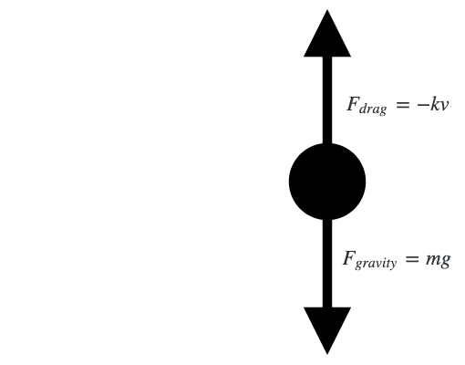

I've been doing some winter cleaning around the house and found my old high school physics notes the other day.
I found this to be a good excuse to whip out some LaTeX and install [MathJax](https://www.mathjax.org/) on this blog!
The derivation of the velocity function describing a falling mass encountering air resistance was my first foray into actually applying calculus in physics, and the beauty of that relationship has always stuck with me.

Let's start by stating Newton's 2nd law:

$$\sum F = ma$$

We can decompose $$\sum F$$ into its constituent forces: gravity and air resistance (drag). Let's represent air resistance as a function of how fast the mass is moving multiplied by a linear constant:

$$F_{gravity} - F_{drag} = mg - kv = ma$$

This is the corresponding free-body diagram. Note that "down" is marked positive for simplicity:

<!--more-->

Let's start the derivation by dividing out the mass from all quantities:

$$g - \frac{kv}{m} = a$$

Rewrite the acceleration as the change in velocity over change in time:

$$g - \frac{kv}{m} = \frac{dv}{dt}$$

Separate out velocity and time:

$$dt = \frac{1}{g - \frac{kv}{m}} \, dv $$

Begin integrating. Assume $$v_0$$ to be $$0$$, i.e. the object starts from rest:

$$\int_{0}^{t} dt = \int_{0}^{v} \frac{1}{g - \frac{kv}{m}} \, dv $$

Evaluating the left side is trivial:

$$t = \int_{0}^{v} \frac{1}{g - \frac{kv}{m}} \, dv$$

To evaluate the right side, let's do some substitution. Let $$u$$ equal the denominator:

$$u = g - \frac{kv}{m}$$

From which we can get $$dv$$:

$$\frac{du}{dv} = -\frac{k}{m}$$

$$dv = -\frac{m}{k} \, du$$

We also need to obtain the bounds of our new integral. We already defined $$u$$ above, so we only need to find $$u_0$$. Recall that $$v_0 = 0$$:

$$u_0 = g - \frac{kv}{m} = g - \frac{k \cdot 0}{m} = g$$

We can now use $$u$$, $$du$$, and their bounds of integration:

$$t = -\frac{m}{k} \int_{u_0 = g}^{u = g - \frac{kv}{m}} \frac{1}{u} \, du$$

Evaluate the integral:

$$t = -\frac{m}{k} \Big[ ln(u) \, \Big|_g^{g - \frac{kv}{m}}$$

$$t = -\frac{m}{k} \Big( ln \Big( g - \frac{kv}{m} \Big) - ln(g) \Big)$$

Rearrange terms, combine the natural log expressions, and simplify:

$$-\frac{kt}{m} = ln \Big( g - \frac{kv}{m} \Big) - ln(g)$$

$$-\frac{kt}{m} = ln \bigg( \frac{g - \frac{kv}{m}}{g} \bigg)$$

$$-\frac{kt}{m} = ln \Big( 1 - \frac{kv}{mg} \Big)$$

Exponentiate each side with the exponential function:

$$e^{-\frac{kt}{m}} = 1 - \frac{kv}{mg}$$

Finally, we can get the velocity as a function of time:

$$\frac{kv}{mg} = 1 - e^{-\frac{kt}{m}}$$

$$v(t) = \frac{mg}{k} \Big(1 - e^{-\frac{kt}{m}} \Big)$$

From our initial $$\sum F$$ equation, we could directly find the terminal velocity, the point at which the net forces acting on the mass is equal to $$0$$:

$$mg - kv = 0$$

$$v = \frac{mg}{k}$$

We can also arrive at the same conclusion using our derived velocity function.
An exponential function with a negative exponent term tends toward $$0$$ as $$t$$ gets larger.
According to our function, we'll similarly be left with $$v = \frac{mg}{k}$$, since the limit of $$e^{-\frac{kt}{m}}$$ as $$t$$ approaches infinity is 0.
